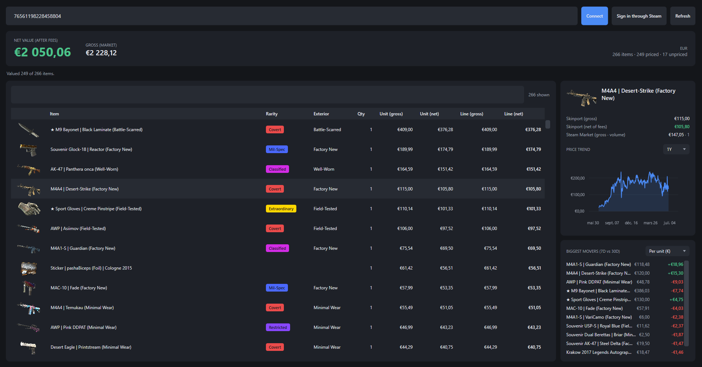

# CS2 Inventory Valuator

A small Windows desktop app that connects to a Steam account, pulls in its public
Counter-Strike 2 inventory and works out what it is actually worth. It shows the market value
of everything you own and, more usefully, what you would really walk away with after
marketplace fees.



## Installation

Go to the release page and download the latest release .zip file containing the application executable, you should be able to run it on your computer. (Confirmed working on Windows 11)

## How to use

You paste a SteamID or a profile URL, or sign in through Steam, and the app imports your
inventory with images and quantities. It prices everything against live Skinport data and shows
a big headline number for the whole inventory, both the gross market value and the net value
after fees. You can sort and filter the list, and click any item to see more detail: the
Skinport price, a second price and trade volume from the Steam Market, and a price chart. There
is also a biggest movers panel that ranks your items by how much they have moved recently, and
you can switch between ranking by percentage, by per item value or by total value.

Everything is cached to a local SQLite database, so the app opens straight away with your last
inventory and still works when the network is down. If an inventory is private it tells you how
to make it public instead of just failing.

## Codebase Architecture

Application is separated in four modules. Core holds the domain model and the valuation logic and depends on
nothing else. Infrastructure has the HTTP clients for Steam and Skinport, the EF Core and SQLite
data layer, and a small background service that records prices over time.  MVVM pattern using CommunityToolkit.Mvvm and wired together with
dependency injection through the generic host. There is also a test project.

A couple of notes on where the data comes from. Skinport gives current prices and recent sales
history, each in a single bulk call, so valuations and movers are available right away. The
Steam Market is queried one item at a time, only when you open an item, because it is heavily
rate limited. The day by day price chart comes from Steam's own price history, which only
answers when you are signed in, so the app reuses the session from the sign in window for those
requests.

##  Development setup

You need the .NET SDK (the version is pinned in global.json) on Windows, plus the WebView2
runtime for the Steam sign in window, which is already installed on most Windows 10 and 11
machines.

```
dotnet build CStoValuation.sln
dotnet test
dotnet run --project src/CStoValuation.App
```

Paste a public SteamID or profile URL and click Connect, or use Sign in through Steam. The
default currency is EUR and the seller fee defaults to 8 percent, both of which live in one
place and are easy to change.

## CICD

Every push and pull request builds the whole solution and runs the tests on Windows through
GitHub Actions.
